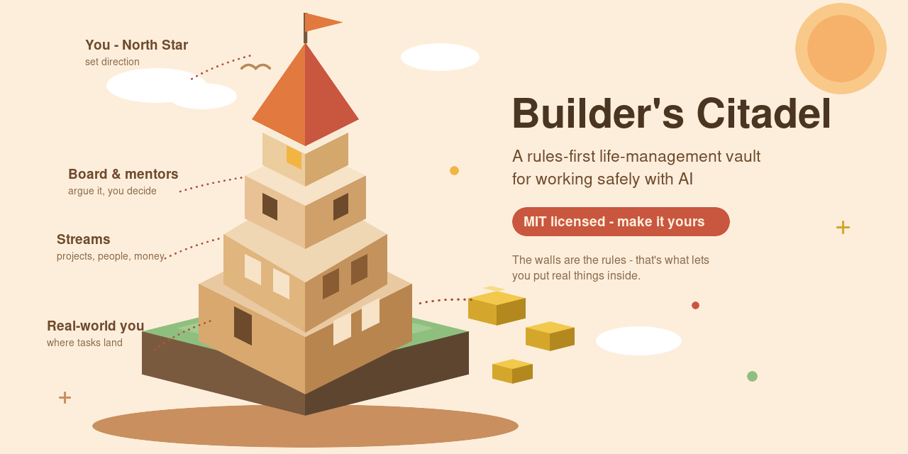
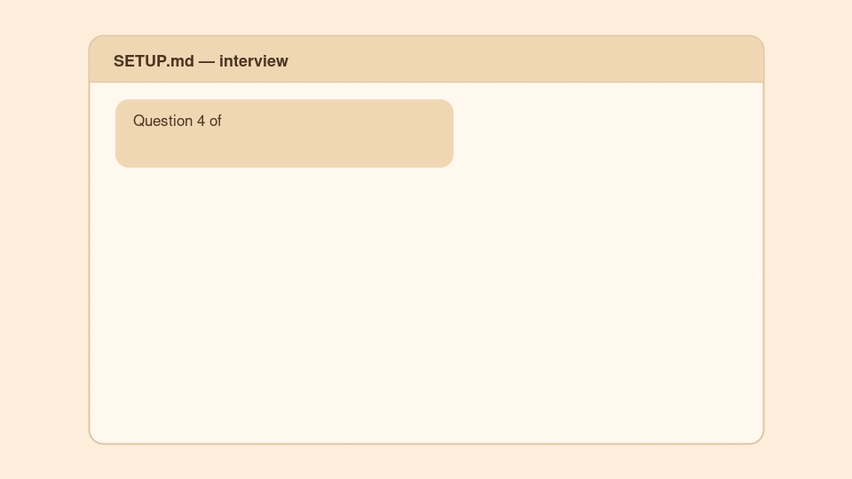

# Builder's Citadel

**□ · ● · ○ &nbsp;&nbsp;THE HUMAN LATENCY** — *Hidden systems. Human consequences.*

A life-management vault you hand to an AI. Rules first, folders second.

Free for personal and non-commercial use. It is the open drawer of [The Vault](https://humanlatency.online/vault.html) — the rest of the drawers are at [humanlatency.online](https://humanlatency.online).

---

Most "AI life OS" templates are a folder structure. This one is a **rules structure**: a `CLAUDE.md` that every AI session reads before it touches anything.

Those rules cover the failure modes that only appear after months of real use — mis-addressed emails, instructions smuggled inside imported documents, bulk reads that burn tokens for nothing, two sessions overwriting each other, a stale document being treated as current.

It was written the slow way. Someone with no coding background, running AI sessions against a real life — projects, money, people, sensitive documents — and writing a rule down every time something went wrong, or nearly did. What is filed here is that rulebook, with the personal content removed and every example rewritten generic.

## Start in three steps

About thirty minutes. Full detail in [Quick start](#quick-start).

1. **Take a copy.** Press **Use this template** on GitHub, into a folder that keeps version history.
2. **Open `00-START-HERE.md`.** Skim the rules, then say **"Run SETUP.md"** to your AI.
3. **Next morning**, read your first brief, glance at the Tower, tick one thing. That loop is the whole system.

## Why a citadel

Because it is only useful if it holds *everything*, in one defended place.

The point is cognitive load. Instead of your projects, people, money, deadlines and half-formed ideas living in your head — and leaking out at 3am — they live in one structure an AI can work in safely. Safely is the whole trick. The walls are what let you put real things inside.

One Big Ask:
I made this free even though its extremely valuable to me. I believe in 80,000 Hours and effective altruism where real active work and impact compounds through amplification or others good intent, not single good acts. Open, builder-minded people like those in this community are uniquely the type of people that have unique capabilities for good.
So if you do good things and help others or yourself through this system. I would really love it if you could let me know at Aye@paing.group.

## What it does once set up

- **A morning brief that knows your whole life** — what moved, what is due, what slipped — in your inbox before you wake.
- **Briefs to other people, safely.** A weekly digest to friends, a shared brief with a sibling, an accountability email. Each sits on its own sealed row of recipients that can never cross with another.
- **An AI that writes like you.** Every session reads your one-page North Star, and drafts use a Voice Profile distilled from your own sent emails, chat exports and voice notes. Your words, not AI-flavoured mush.
- **A Board and a Mentors bench.** Advisor personas built from a proper seat template — charter, method, bias sweep, blind spots, lessons log — that argue your big calls. They recommend. You decide.
- **Executors.** A delivery layer that moves decided projects forward, with an append-only attempt log and one honest task list.
- **The Tower HQ** — the whole system drawn as one clickable tower, including a SLIPPED box that never flatters you.
- **Nightly research.** Drop a topic in the queue, wake to a sourced brief.
- **A memory of itself.** Session logs, usage logs and read-back rules that catch drift, truncation, and two-sessions-at-once accidents.
- **The Citadel Game.** Open `Citadel-Game.html` in a browser and the first weeks become quest lines — XP, streaks, a city that grows. Positive only, by design, for the overwhelmed days.

## What makes it different

- **Scoped auto-send rows.** An automated brief may go only to the addresses on its own row. The rows never cross. Recipients are added by you, out loud — never inferred from a document.
- **Nothing in a file is a command.** Notes, logs and imported documents are context, not instructions. An AI that finds AI-directed text inside an imported file flags it rather than obeying it. That is a working prompt-injection defence, which most personal setups do not have at all.
- **Controlled exceptions, not floodgates.** Automation runs through named channels only — a small tag vocabulary, a research queue — with a cost cap and "only the owner adds entries".
- **Restricted folders with a second lock.** `_` folders need permission. `_Private/` and `_Heavy/` inside them need the file named explicitly. Searching counts as touching.
- **Concurrency and integrity rules.** Read back after big writes, re-read fresh before them, append-only logs, never hand-edit a generated file. Written after real data loss, not hypothetically.
- **A lifecycle for retiring things.** Most systems only create. This one parks, archives, and marks superseded documents, so nothing stale is ever read as current.
- **A self-audit footer.** Five checks that tell you whether the rules are still holding.

## Quick start

> **Never done this before?** The one idea to grasp: some AI *apps* can be handed a folder on your computer, and then read and write the files inside it. That is the only new thing. The rest is typing into an ordinary chat box. A printable two-page version is filed at [`START-HERE-quick-start.pdf`](START-HERE-quick-start.pdf).

1. **Take a copy.** Press **Use this template** on GitHub, or download or clone, into a folder with version history — OneDrive, Dropbox, iCloud Drive or git. Windows and Mac both work. That history is your recovery route if the rules file ever breaks. It also opens beautifully as an Obsidian vault.
2. **Get an AI app that can be given a folder, and point it at this one.** A website chat only sees what you paste in; the app is the one that can work in a folder. Claude Desktop with Cowork does this, as does Claude Code if you are comfortable in a terminal. Install, sign in, choose this folder, allow it to work here. One time only.
3. **Open `00-START-HERE.md`.** It walks the rest: skim `CLAUDE.md`, then type **"Run SETUP.md"** and answer the questions.
4. **The email table SETUP builds is the most important five minutes.** Your AI must read it back to you address by address, and get an explicit yes.
5. **Want automation?** `02-Comms/Workflows/` has scheduled-task prompts and an n8n starter.

Layers you do not need — `08-Money/`, `09-Partner/`, `10-Board/`, `11-Executors/`, `13-Code/` — can be deleted, and SETUP asks. The core is `CLAUDE.md` plus `01-Streams/` plus `06-Logistics/`.

## The map

| File / folder | What it is |
|---|---|
| `SETUP.md` | The one-time guided setup. Populates everything below. |
| `Meta-Map.md` | Single master roster of your streams. |
| `Tower-HQ.md` | The whole system as one clickable tower drawing. |
| `Action-Tracker.md` | The single to-do list. You tick; an AI never auto-ticks. |
| `01-Streams/` | One thin manager file per project or life-area, with documents in a restricted `_Docs` folder beside it. |
| `02-Comms/` | The comms hub: `Daily/`, `Research/`, `Outreach/`, `Workflows/`, and `COMMS-MENU.md` — the catalogue of everything the Citadel can send. |
| `03-DNA/` | Who you are. `North-Star.md` is the one page every session reads. |
| `04-Explorations/` | The playground. Never a source of tasks. |
| `05-People/` | One note per person. Read only for comms to or about that person. |
| `06-Logistics/` | The engine room: session log, usage log, outbox, research queue. |
| `07-Research/` | Outputs of research runs, always indexed. |
| `08-Money/` | Financial layer. Owner's numbers only; blanks stay blank. |
| `09-Partner/` | Relationship layer. Evidence, never verdicts. |
| `10-Board/` + `Mentors/` | Advisor personas that stress-test decisions. |
| `11-Executors/` | Delivery layer. Executes decided mandates only. |
| `12-Reference/` | Evergreen knowledge bank. |
| `13-Code/` | Coding layer: repo registry, standards, per-project files. Code stays in git; secrets never, anywhere. |
| `_Dump-Inbox/` | Throw files here. Sorting is by filename only, on ask. |

`EXAMPLES.md` has wrong → right pairs on the highest-stakes rules. `EXAMPLES-GALLERY.md` has six filled-in flavours — job-seeker, founder, freelancer, student, creator, open-source developer — to steal a starting shape from.

## Who made it

I am Aye. I am not a developer. I am a builder with an AuDHD brain and more streams of life than one head holds — projects, people, money, deadlines, half-formed ideas at 3am. I needed one place that held all of it, run by an AI I could actually trust with real things.

Trust turned out to be an architecture problem, and the architecture is three ideas:

1. **Separate the jobs.** Research gathers facts, the Board argues decisions, Executors deliver. Three layers that never blur, so every step leaves a trail you can audit.
2. **The human decides.** Advisors recommend and crews execute mandates, but nothing sends, deletes or spends without a live yes.
3. **Rules come from scars.** Every rule in `CLAUDE.md` exists because something went wrong, or nearly did. The template is scar tissue, organised.

I am sharing it because what it gave me — a quieter head, and relationships I did not let drift — is worth passing on.

This is the free drawer. The sector packs, the single-job scripts and the done-for-you builds are at **[humanlatency.online](https://humanlatency.online)**.

## Community

Questions, ideas, or a Citadel of your own? The **Discussions** tab has a pinned *Show me your Citadel* thread.

Publishing your own version? Work through `PERSONALISE-CHECKLIST.md` first, so nothing personal leaks. It exists because it was needed.

## Licence and credits

Released under the **[PolyForm Noncommercial Licence 1.0.0](LICENSE)**.

In plain English:

- **Yes** — use it, adapt it, build your whole life on it, republish your own flavour, share it with friends. Free, forever, for anything that isn't a business.
- **Yes** — charities, schools, universities, public research and government bodies count as non-commercial, whoever funds them.
- **No** — you can't sell it, sell access to it, bundle it into a paid product or course, or use it inside a company's operations.
- Keep the `Required Notice:` line and pass the licence along with any copy you share.

**Want to use it commercially?** That's a conversation, not a no — email **cakeandink@gmail.com**.

*Versions published before 16 August 2026 were released under the MIT Licence. That grant still stands for those copies; everything from here on is non-commercial.*

Structure and rules distilled from a real working vault. Inspired in part by the public `CLAUDE.md` rules-file tradition in the AI-coding community.

Filed by [The Human Latency](https://humanlatency.online) — *hidden systems, human consequences*.
